# 1 - Sugestão para estrutura de pastas

- Com o objetivo de organizar o projeto estruture o projeto de modo que dentro da pasta "src" existam as pastas dos componentes chamada `components` e a pasta de paginas chamada `pages`. Na pasta `components` devem ser criados os componentes funcionais do projeto e na `pasta` page deve conter cada aba da pagina da loja `drip-store`, contendo somente a chamada dos componentes criados. Essa organização facilitará a criação de rotas dentro do arquivo `App.js`.

```
├── src/
│   ├── compoments/
│   │   ├── Header
│   │   ├── Footer
│   │   ├── Logo
│   │   ├── ProductListing
│   │   ├── ProductCard
│   │   ├── ProductOptions
│   │   ├── BuyBox
│   │   ├── Section
│   │   ├── FilterGroup
│   │   └── ProductDetails
│   └── pages/
│       ├── HomePage
│       ├── ProductViewPage
│       └── ProductListingPage
├── App.js
└── index.js

```

# 2 - Cores

- primary **#C92071**
- secondary **#B5B6F2**
- tertiary **#991956**
- error **#EE4266**
- success **#52CA76**
- warning **#F6AA1C**

**Grayscale**
- dark-gray **#1F1F1F**
- dark-gray-2 **#474747**
- dark-gray-3 **#666666**
- light-gray **#8F8F8F**
- light-gray-2 **#CCCCCC**
- light-gray-3 **#F5F5F5**
- white **#FFFFFF**


# 3 - Layout

<details>
  <summary><strong>Introdução</strong></summary>

- O layout é a aparência visual consistente em todas as páginas do sistema. Ele inclui partes que são iguais em todas as telas, como o cabeçalho (uma barra no topo da página) e o rodapé (uma área na parte inferior da página).

- Para criar o layout, usamos componentes especiais como: o `<Header />`, que representa o cabeçalho da página e contém elementos como o logo da aplicação; os links de navegação e; o `<Footer />`, que é exibido na parte inferior da página e pode incluir informações como direitos autorais e links para redes sociais.

- O componente de layout deverá receber uma prop chamada `children`, para renderizar as páginas entre os componentes `<Header />` e `<Footer />`.
 
- O componente de layout deverá ser criado no diretório `src/pages` 

A estrutura acima descrita pode ser visualizada na imagem a seguir.

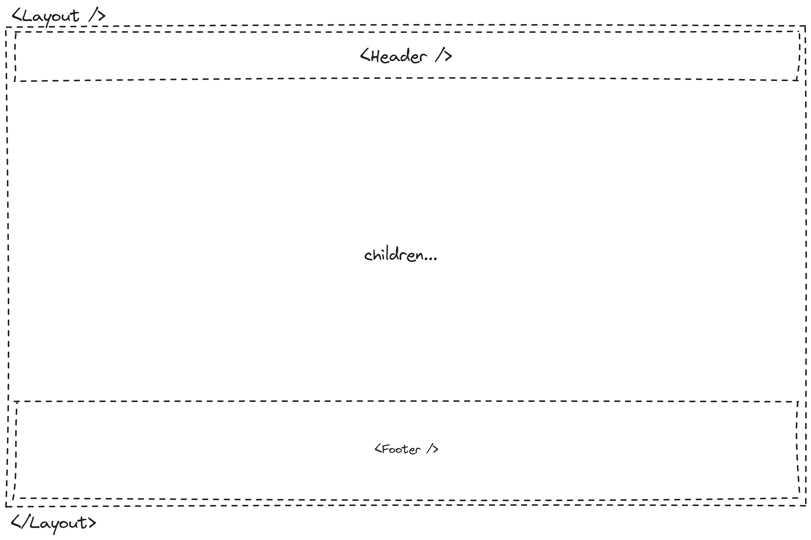

- Exemplo de código do componente `<Layout />`:

```React 
import React from 'react';

// Definindo o componente de layout
const Layout = ({ children }) => {
  return (
    <div>
      {/* Componente do cabeçalho */}
      <Header />

      {/* Conteúdo dinâmico das páginas */}
      {children}

      {/* Componente do rodapé */}
      <Footer />
    </div>
  );
};

export default Layout;
```

</details>

<details>
  <summary><strong>Requisitos</strong></summary>

## 3.1 - Cabeçalho (`<Header />`)

### 3.1.1 - Componente de Logo

- Crie um componente `<Logo />` em `src/components` capaz de renderizar a imagem da logomarca da aplicação. A imagem encontra-se na pasta `src/assets` e ela deverá ter o tamanho de 253 pixels de largura (width) e 44 pixels de altura (height).

### 3.1.2 - Campo de busca

- Crie um campo de busca que realize o filtro de produtos da plataforma. O campo deve possuir um ícone de lupa ao lado direito e realizar a busca ao ser clicado ou ao pressionar `Enter`, redirecionando para a rota `/products` com a **query string** do filtro.

Ex.: Se uma pessoa usuária escrever `microondas` no campo de busca, ao clicar no ícone de lupa do campo a página  deve ser redirecionada para `/products?filter=microondas`

### 3.1.3 - Área de Redirecionamento

Aréa de redirecionamento será um lugar no cabeçalho ao lado do compo de pesquisa que tem como objetivo redirecionar o usuário para as telas de login e cadastro.

- Adicionamento um elemento html de link com o texto *Cadastre-se*. Esse elemento deve ser renderizado em uma fonte de 16px na cor `dark-gray-2` com uma sublinhado na mesma cor.
- Adicionamento um elemento html de link *Entrar*. Esse elemento vai ter uma aparencia de "botão", com um preenchimento na cor `primary`, largura de 114px por 40px de altura, bordas arrendondadas em 4px e texto em negrito na cor `white` e font de 14px.

### 3.1.4 - Carrinho de compras

O carrinho de compras será some um icone renderizado ao lado da area de redirecionamento, não tem ação de clique e pode ser usado o svg que se encontra no diretorio `src/assets`

### 3.1.5 - Navegação Principal

- Crie um componente de navegação com 4 links para as principais páginas da plataforma (Home, Produtos, Categorias, Meus Pedidos).
- Quando o usuário estiver na página correspondente ao link, ele deve ter uma coloração diferente e uma linha horizontal abaixo.

<strong>Sugestão:</strong> Use o componente **NavLink** do `react-router-dom`.

**Estrutura**
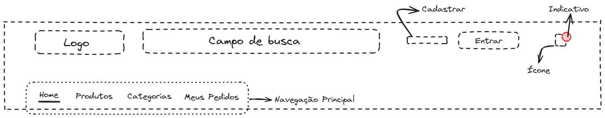

## 3.2 - Rodapé (`<Footer />`)

- O fundo do rodapé deve ser na cor `dark-gray` e o todos os texto devem ser na cor `white` para garantir boa legibilidade.

- Utilize o componente `<Logo />` criado no cabeçalho para renderizar a imagem da logo em cor branca.

- Insira um texto (Lorem ipsum) para preencher a descrição da empresa abaixo da logo.

- Use os svgs da pasta `src/assets`, abaixo da descrição, que redirecionem para as respectivas redes ao serem clicados.

### 3.2.1 - Componente de informações

- Crie um componente de informações
- Esse componente deve receber uma propriedade chamada `title`, onde será o titulo do componente
- Esse componente deve receber uma propriedade chamada `informations`, onde será um array de objetos. 

```json
[
  {
    "text": "Sobre Drip Store",
    "link": "/about"
  },
  {
    "text": "Blog",
    "link": "/blog"
  },
  ...
]
```
- As informações (`informations`), devem ser renderizadas dinamicamente de acordo com a quantidade de objetos dentro do array.


  

- Abaixo de todos os elementos do rodapé, insira um `<hr />` e logo abaixo uma parágrafo com data atual com o texto "© 2024 Digital Store" para indicar os direitos autorais da página.

**Estrutura**

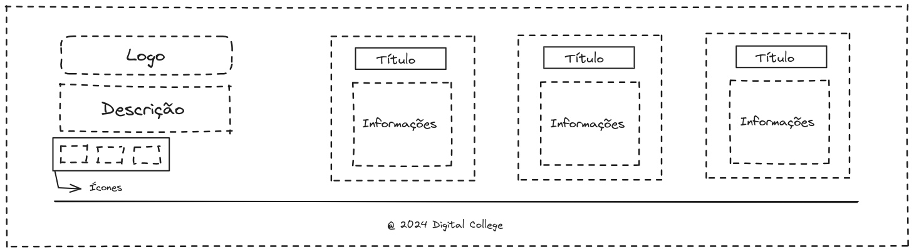

</details>


# 4 - Componentes compartilhados

<details>
  <summary>
	<strong>Introdução</strong>
  </summary>

Componentes compartilhados são componentes onde serão utilizados em duas ou mais páginas. O objetivo destes componentes são de adicionar flexibilidade para atender as necessidades de diferentes páginas.
</details>

<details>
  <summary>
	<strong>Requisitos</strong>
  </summary>

  
## 4.1 Componente de seção

  Esse componente será criado para estabelecer um padrão nas seções que irão compor as páginas.

  Este componente será utilizado sempre que for necessário renderizar uma lista de produtos, de imagens, de ícones ou de qualquer outro conteúdo que precise possuir um título.


  - Criar um componente `<Section />` em `src/components`
  - O componente deve ser capaz de renderizar um título em posições diferente, elementos filhos que podem ser passados entre as tags de abertura (`<Section>`) e fechamento (`</Section>`) e opcionalmente um link

  *Propriedades*
  - A propriedade`title` deve ser usada para renderizar o título (na cor `dark-gray-2` com uma fonte de 24px)
  - A propriedade `titleAlign` deve receber como valor "**left**" ou "**center**" e vai definir as duas posições possíveis para o titulo, se essa propriedade não for informada o título deve assumir o valor "**left**" como **posição padrão**.
  - A propriedade `link` deve ser usada para renderizar um link (na cor `primary` com uma fonte de 18px) do lado direito alinhado vertical com o título. O objeto passado para essa propriedade deve seguir o seguinte padrão
	```json
	{
  	"text": "Show More",
  	"href": "https://redirect.link"
	}
	```
  - A propriedade `children` vai ter como valor todos os elementos filhos da tag `<Section />` e deve ser usado para tornar esse componente mais dinâmico e reutilizável.

**Estrutura**
  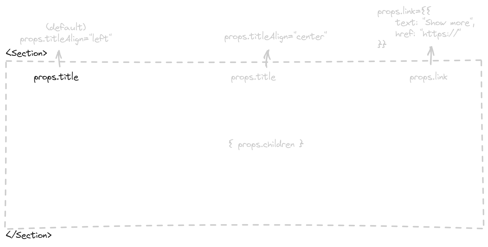


## 4.2 - Componente para cartão de produto

  Um componente para exibir informações principais sobre o produto como nome, preço e preço com desconto.


  - Criar um componente `<ProductCard />` em `src/components`
  - O componente deve ser capaz de renderizar imagem, nome, preço e preço com desconto
 
  *Propriedades*
  - A propriedade `imagem` deve ser usada para renderizar a imagem do produto nas dimensões 292x321 pixels.
  - A propriedade `name` deve ser usada para renderizar o nome do produto logo abaixo da imagem
  - A propriedade `price` deve ser usada para renderizar o preço (na cor `dark-gray` com uma fonte de 24px) do produto logo abaixo do nome.
  - Se for propriedade `priceDiscount` for informada, a renderização de `price` deve ser alterada, exibindo um preço na cor `light-gray` e com linha cortando o preço
  - A propriedade `priceDiscount` deve ser usada para renderizar o preço com desconto (na cor `dark-gray` com uma fonte de 24px)

**Estrutura** 

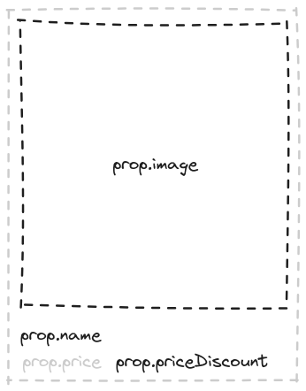


## 4.3 - Componente de listagem de produtos

  Esse componente atuará como um encapsulador (_wrap_), ou seja, um componente que acomodará todos os componentes `<ProductCard />` dentro dele.

  - Criar componente `<ProductListing />` em `src/components`
  - O componente deve ser capaz de receber um lista de produtos e renderizar usando o componente `<ProductCard />`
 
  *Propriedades*
  - A propriedade `products` deve ser usada em um loop usando o componente `<ProductCard />` para exibir uma lista de produtos
  - A propriedade `products` deve receber como valor um array de objetos seguindo o seguinte padrão
	```json
	[
  	{
    	name: "Nome do produto 1",
    	image: "https://url.imagem/do/produto1.png",
    	price: 200,
    	priceDiscount: 149.9
  	},
  	{
    	name: "Nome do produto 2",
    	image: "https://url.imagem/do/produto2.png",
    	price: 49.9
  	}
	]
	```

**Estrutura** 
  


## 4.4 - Componente de Galeria de imagens

  Exemplo de slide carrossel. 
  
  

  Neste componente as imagens serão exibidas mediante ao clique em icones de setas.

  O componente de galeria é uma forma de exibir uma série de itens em uma interface de usuário, permitindo que o usuário navegue entre eles de forma interativa.

  O componente de galleria deve receber uma lista de imagens e mais algumas propriedades opcionais para definir a renderização dessas imagens.
  Este componente vai sempre exibir um slide de imagens que passa para o lado mediante ao clique dos ícones para direita ou para esquerda.
  Opcionalmente esse componente renderizará _thumbnails_, que são miniaturas das imagens, na parte inferior do slide

  - Criar um componente `<Gallery />` em `src/components`
  - O componente poderá ter as seguintes propriedades:
  	- `className` pode ser usado para passar nome de classes CSS para o elemento que estiver como pai de todos os outros elementos da galeria
  	- `width` pode receber um valor em pixel para definir a largura que o slide de imagens deve ser renderizado. Exemplo: `<Gallery width="1440">`
  	- `height` pode receber um valor em pixel para definir a altura que o slide de imagens deve ser renderizado. Exemplo: `<Gallery height="681">`
  	- `radius` deve receber uma strig indicando o valor em pixel do arredondamento das bordas da imagem. Exemplo: `<Gallery radius="4px">`
  	- `showThumbs` não recebe valor nenhum, quando essa propriedade existir, o componente deve exibir as imagens em miniaturas (com 117px de largura por 95px de altura) na parte inferior do slide de imagens.
    	Caso a propriedade `showthumbs` não estiver presente, nenhuma miniatura das imagens deve ser exibida.
    	O valor do atributo `radius` deve ser aplicado para arredondar as bordas das imagens em miniaturas.
  	- `images` é a propriedade mais importante para o funcionamento desse componente. Essa propriedade deve receber como valor um array de objetos seguindo esse padrão
    	```json
      	[
            { "src": "http://site.com/path/to/image1.png" }
            { "src": "http://site.com/path/to/image2.png" }
            { "src": "http://site.com/path/to/image3.png" }
            { "src": "http://site.com/path/to/image4.png" }
            { "src": "http://site.com/path/to/image5.png" }
      	]
    	```
  - Internamente o componente `<Gallery />` deve renderizar a primeira imagem recebida na propriedade `imagens` e as imagens seguintes devem ficar "escondidas" e ser exibidas somente quando clicar em umas das setas.
  - Fixo no lado direito e alinhado verticalmente, deve ser renderizado o ícone de seta para a direita que pode ser encontrado no caminho `assets/icons/arrow-right.svg`
  - Fixo no lado esquerdo e alinhado verticalmente, deve ser renderizado o ícone de seta para a esquerda que pode ser encontrado no caminho `assets/icons/arrow-left.svg`
  - Ao clicar na seta da direita, a imagem atual deve deslizar para a esquerda dando espaço para a próxima imagem ser renderizada
  - Ao clicar na seta da esquerda, a imagem atual deve deslizar para a direita dando espaço para a imagem anterior ser renderizada
  - Quando a primeira imagem estiver renderizada, a seta da esquerda deve ficar desabilitada
  - Quando a última imagem estiver renderizada, a seta da direita deve ficar desabilitada
  - Ao selecionar uma miniatura da galeria, a imagem em destaque deve ser alterada para exibir a imagem que está na miniatura
  - Uma borda de 2px na cor `primary` deve ser aplicada na miniatura que for selecionada

**Estrutura da galeria de imagens exibida na home**
  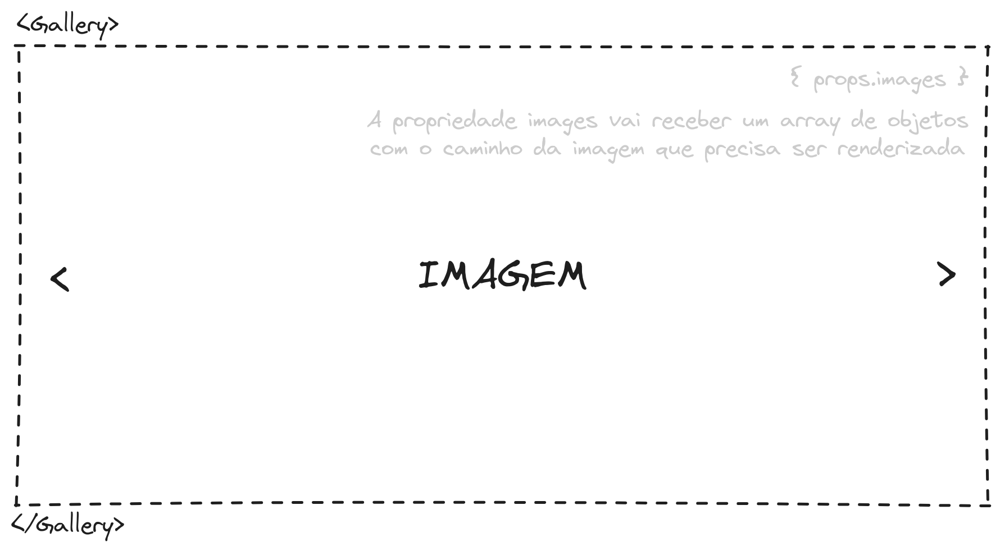
 
**Estrutura da galeria de imagens exibida na home**
  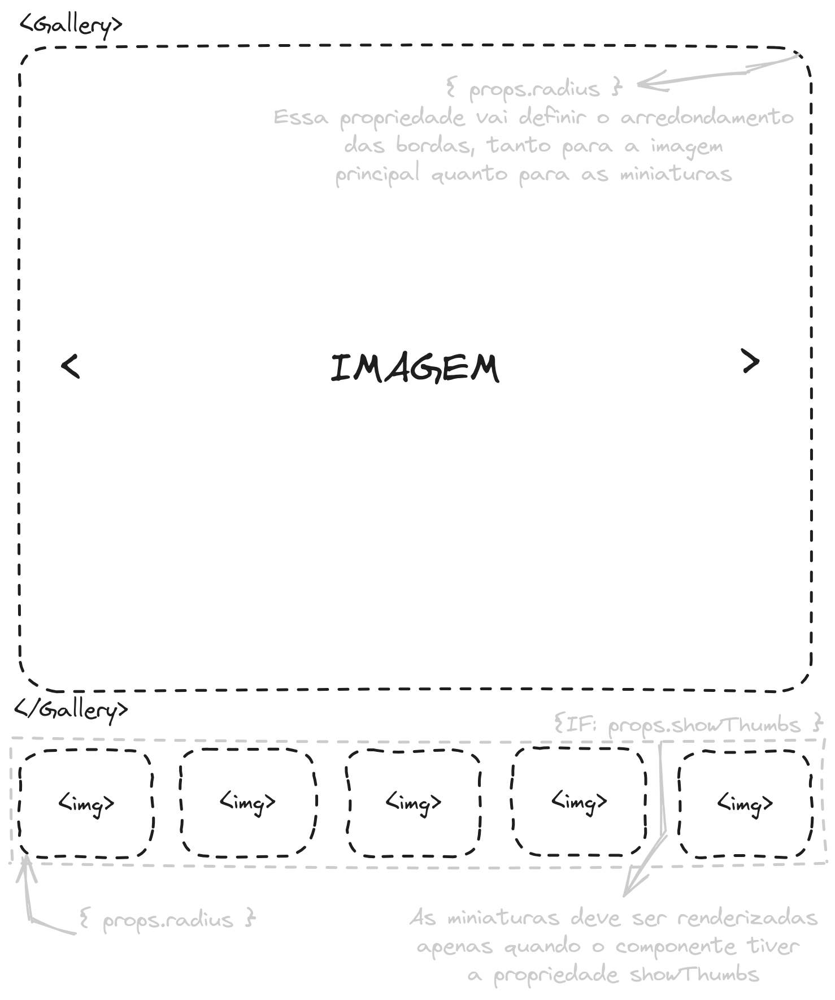

</details>


# 5 . Página inicial

<details>
<summary>
  <strong>Introdução</strong>
</summary>

  A página inicial renderizará uma galeria de imagens, coleções em destaquee e produtos em alta.

</details>


  <details>
  <summary>
    <strong>React Router DOM</strong>
  </summary>

    - Criar um componente `<HomePage />` em `src/pages`
    - Esse componente deve ser usado como `element` da rota `/`
    - Esse componente deve usar o componente `<Layout />` para garantir a reutilização do header e do footer

  </details>

<details>
<summary>
  <strong>Requisitos</strong>
</summary>

## 5.1 - Slide de imagens

Aqui deve ser usado o componente `<Gallery />` visto anteriormente informando as seguintes propriedades

- `images` recebe um array de objetos seguindo esse padrão
    ```json
    [
      {"src": "public/home-slide-1.jpeg"}
      {"src": "public/home-slide-2.jpeg"}
      ...
    ]
    ```
    No diretório `public` pode ser encontrado mais imagens para usar na galeria da home page
- `width` recebe o valor 1440px
- `height` recebe o valor 681px

## 5.2 - Coleções em destaque

Usando o componente `<Section />` deve ser renderizado 3 imagens na horizontal, com bordas arredondadas em 4px.
Caminho para as imagens que deve ser usadas:
- `public/collection-1.png`
- `public/collection-2.png`
- `public/collection-3.png`

Para essa listagem de imagens deve ser usado elementos comum de HTML e CSS como filhos do componente `<Section />`

*Propriedades para o componente `<Section />`*
- `title` recebe o valor *Coleções em destaque*
- `titleAlign` receber o valor *center*

## 5.3 - Produtos em alta

Usando os componentes `<Section />` e `<ProductListing />` deve ser renderizado uma listagem de produto exibindo no total 8 produtos.

*Propriedades de componente `<Section />`*
- `title` deve receber o valor *Produtos em alta*
- `titleAlign` deve receber o valor *left*

*Propriedades de componente `<ProductListing />`*
- `products` deve receber um array de objetos seguindo esse padrão
    ```json
      [
        {
          name: "Nome do produto",
          image: "public/product-thumb-1.png",
          price: 200,
          priceDiscount: 149.9
        },
        {
          name: "Nome do produto",
          image: "public/product-thumb-2.png",
          price: 49.9
        }
        ...
      ]
    ```
    Mais imagens para a listagem de produtos podem ser encontradas no diretório `public`

**Estrutura**
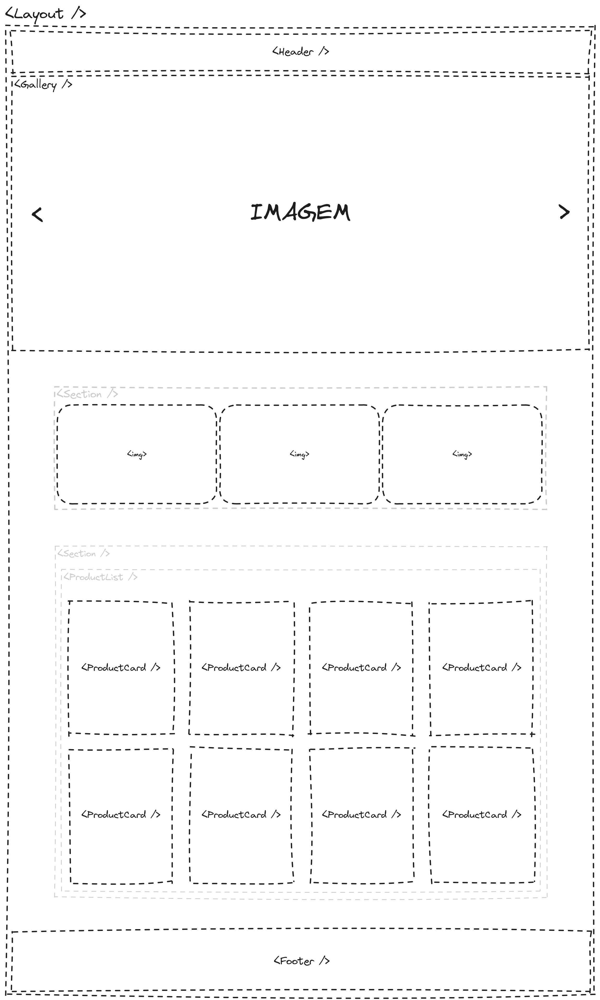
</details>


# 6 - Página de listagem de produtos

<details>
<summary>
  <strong>Introdução</strong>
</summary>
  A página de listagem de produtos vai renderizar filtros e um lista de produtos, essa pagina vai ser o destino do campo de pesquisa e no menu *Produtos*.
  Nessa página o usuário vai poder visualizar todos os produtos e filtrar e ordenar o resultado de produtos marcando diferentes campos de seleção. 
</details>

<details>
<summary>
  <strong>React Router DOM</strong>
</summary>

  - Criar um componente `<ProductListingPage />` em `src/pages`
  - Esse componente deve ser usado como `element` da rota `/produtos`
  - Esse componente deve usar o componente `<Layout />` para garantir a reutilização do header e do footer
</details>

<details>
<summary>
  <strong>Requisitos</strong>
</summary>

## 6.1 - Ordenar por

Na lateral esquerda da página deve ser renderizado um campo (com 308px de largura e 60px de altura) de seleção para selecionar a ordem em que os produtos devem ser exibidos.
A label desse campo ter renderizar o texto "Ordenar por" com uma fonte de 16px na cor `dark-gray-2`
Esse campo de ordenação deve exibir as seguintes opções na cor `dark-gray-2`
- `Menor preço` deve ordenar os produtos pelo preço mais barato
- `Maior preço` deve ordenar os produtos pelo preço mais caro
  
## 6.2 - Filtrar por

Ainda na lateral esquerda da página, deve ser renderizado um elemento com preenchimento na cor `white` com uma largura de 308px e uma altura de acordo com o conteúdo renderizado internamente.
Esse elemento também deve ter um título com o texto "Filtrar por" com uma fonte de 16px e na cor `dark-gray-2` e um linha horizontal de 1px na cor `light-gray-2` separado o título do campo de filtro.

**Campos de filtro**

Os campos de filtro devem ser inputs (checkbox ou radio) renderizados na esquerda ao lado da label. Esse inputs devem ter 22px de largura e 22px de altura com um preenchimento na cor `primary`

- Para os campos de filtro vai ser preciso criar um componente `<FilterGroup />` em `src/components`
- Esse componente deve aceitar as seguintes propriedades
  - `title` deve receber como valor o título do grupo de filtros e renderizar com uma fonte de 14px na cor `dark-gray-2`
  - `inputType` deve receber como valor o tipo *checkbox* ou *radio* que separa repassado para o input dentro do componente
  - `options` deve receber como valor um array de objetos seguindo o seguinte padrão
    ```json
      [
        {"text": "Options 1", "value": "opt1"}
        {"text": "Options 2"}
        {"text": "Options 3", "value": "opt3"}
        {"text": "Options 4"}
      ]
    ```
    - O atributo `text` deve ser o conteúdo renderizado como label do input. 
    - O atributo `values` é opcional e quando existir deve ser usado como *value* do input.

*Layout do componente <FilterGroup />*
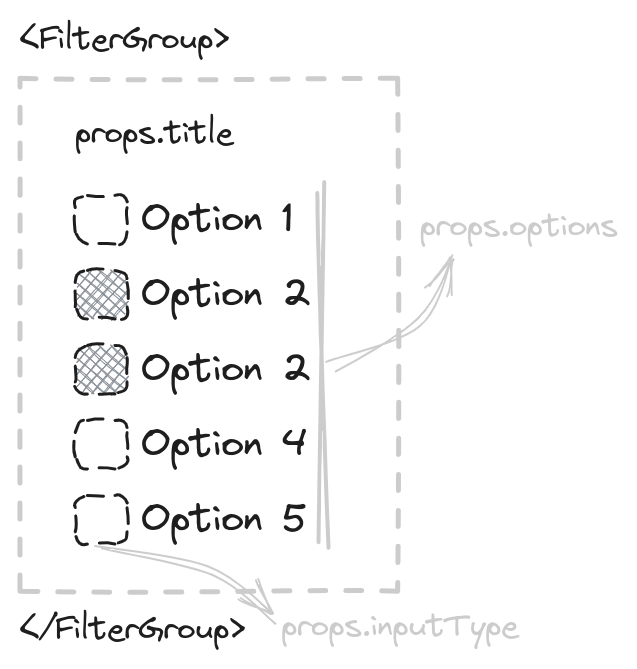

## 6.3 - listagem de produtos

A lado do campos de filtro e ordenação deve aparecer uma lista de produtos usando os componentes `<Section />` e `<ProductList />`

*Propriedades para o componente `<Section />`*

- `title` deve receber como valor o total de produto encontrados e ir alterando de acordo com os filtro aplicados
- `titleAlign` deve receber *left* como valor

*Propriedades para o componente `<ProductListing />`*

- `products` deve receber como valor um array de objetos seguindo o seguinte padrão
	```json
	[
      {
        name: "Nome do produto 1",
        image: "public/product-thumb-1.png",
        price: 200,
        priceDiscount: 149.9
      },
      {
        name: "Nome do produto 2",
        image: "public/product-thumb-2.png",
        price: 49.9
      }
	]
	```
  Mais imagens para a listagem de produtos podem ser encontradas no diretório `public`

**Estrtutura**
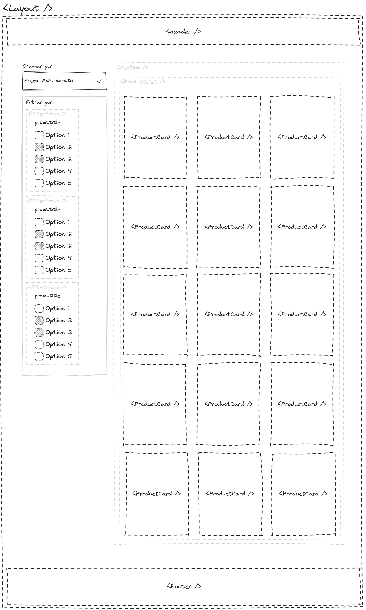
</details>

# 7 -  Página de visualização do produto

<details>
<summary>
  <strong>Introdução</strong>
</summary>

  Essa página vai exibir informações sobre o produto como imagens, nome, preços, descrição, opções e um **call to action** com o botão COMPRAR.

  Também vai ser renderizado uma lista de produtos relacionados
</details>

<details>
<summary>
  <strong>React Router DOM</strong>
</summary>

    - Criar um componente `<ProductViewPage />` em `src/pages`
    - Esse componente deve ser usado como `element` da rota `/product/:id`
    - Esse componente deve usar o componente `<Layout />` para garantir a reutilização do header e do footer

</details>

<details>
<summary>
  <strong>Requisitos</strong>
</summary>

## 7.1 - Componente de galeria
- Deve ser usado o componente `<Gallery />` passando as seguintes propriedade
  - `images` recebe o valor de um array de objetos 
    ```json
      [
        {"src": "public/product-image-1.png"},
        {"src": "public/product-image-2.png"},
        ...
      ]
    ``` 
    Todas as imagens de exemplo para para usar na galeria de produtos podem ser encontradas na diretório `public`
  - `showThumbs` essa propriedade não recebe valor, precisa apenas existir na chamada do componente
  - `width` com o valor de `700px`
  - `height` com o valor de `570px`
  - `radius` com o valor de `4px`
- Esse componente deve ficar ao lado do componente `<BuyBox />`

## 7.2 - Componente de opções do produto

Compone de opção do produto vai ser um componente usado como filho do componente `<BuyBox />` para listar variações do produto como tamanhos e cores.

- Criar um componente `<ProductOptions />` em `src/components`
- Propriedades do componente
  - `options` recebe como valor um array listando as opções que devem ser renderizadas
    Exemplo 1: `["39", "41", "42" ... ]`
    Exemplo 2: `["#000", "#111", "#111" ... ]`
  - `radius` recebe uma string que define o valor do atributo `border-radius` quando `shape` tiver como valor `square`. Se o shape for `circle` essa propriedade deve ser ignorada
  - `shape` recebe como valor "square" ou "circle"
    - `square` deve exibir os itens do array `options` no formato de caixa com largura *alto* e 46px de altura e borda de 1px na cor `light-gray-2`. O valor do `border-radius` dessa caixa deve ser o valor informado na propriedade `radius`
    - `circle` deve exibir os itens do array `options` no formato de círculo com `31px` de largura e `31px` altura.
  - `type` recebe como valor "text" ou "color"
    - `text` deve exibir os itens do array `options` da forma como eles são informados, como um tamanho de fonte de 24px e cor `dark-gray-2`
    - `color` deve usar os itens do array `options` como preenchimento de cor do shape `square` ou `circle`
- Ao selecionar qualquer uma das opções geradas pelo por esse componente, deve ser aplicado uma um borda na cor `pramary` com 2px de largura

## 7.3 - Componente Buy Box

O buy box no contexto de loja virtual é um espaço usado para exibir informações claras e objetivas sobre o produto, facilitando assim o fluxo de compra. Geralmente usado em marketplace place para mostrar o melhor preço ou melhor vendedor, o buy box exibe informações como Nome do produto, preço, preço com desconto, valor do frete, avaliações, descrição e outras opções para o mesmo produto como cores e tamanhos.

- Criar um componente `<BuyBox />` em `src/components`
- Esse componente deve ser capaz de exibir informações sobre o produto por meio das propriedade e dos elementos filhos
- Propriedades do componente
  - `name` recebe o Nome do produto e rederiza com uma fonte de 32px na cor `dark-gray`
  - `reference` recebe o código de referência do produto e renderiza com uma fonte de 12px na cor `dark-gray-3`
  - `stars` recebe o total de estrelas que o produto recebeu e renderiza com uma fonte de 14px em um caixa com bordas arredondadas em 4px e preenchimento na cor `warning`. ao lado do número total de estrelas deve ser exibido um estrela que com um preenchimento `white`. O ícone de estrela pode ser encontrado  o caminho `src/assets/star-icon.svg`
  - `rating` recebe o total de avaliações do produto e renderiza com uma fonte de 14px na cor `light-gray` 
  - `price` recebe
 o preço original do produto (sem desconto) e renderiza com uma fonte de 32px na cor `dark-gray-2`. Se tiver preço com desconto na propriedade `priceDiscount` a renderização de `price` muda para ser exibido com uma fonte de 16px na cor `light-gray-2` com um linha da mesma cor cortando o preço e posicionado ao lado do `priceDiscount` 
  - `priceDiscount` recebe o preço com desconto e renderiza com uma fonte de 32px na cor `dark-gray-2` ao lado do `price` cortado
  - `description` recebe a descrição do produto e renderiza com uma fonte de 14px na cor `dark-gray-2`
- Propriedade `children`
  Um produto pode ter variações de cor e tamanho e nesse caso o ideal é passar um componente `<ProductOptions />` como filho. Outros componentes também podem ser informados como filhos.
- Call to action
  - No final do buy box deve ter um botão comprar com um preenchimento na cor `warning` fonte na cor `white` com 16px

## 7.4 - Produtos recomendados

Para exibir os produtos recomendados vai ser preciso usar dois componentes já explicados anteriormente.  e `<ProductListing />`

- Usar componente `<Section />` com as seguintes propriedades
  - `title` que recebe como valor "Produtos recomendados"
  - `titleAlign` que recebe como valor "left"
  - `link` que recebe como valor 
      ```json
      {
    	  "text": "Ver todos",
        "href": "/products"
      }
    ```
Dentro do componente `<Section />` deve ser passado como filho o componente `<ProductListing />` com as seguintes propriedades

- `products` que recebe como valor
    ```json
      [
        {
          name: "Nome do produto 1",
          image: "https://url.imagem/do/produto1.png",
          price: 200,
          priceDiscount: 149.9
        },
        {
          name: "Nome do produto 2",
          image: "https://url.imagem/do/produto2.png",
          price: 49.9
        }
      ]
    ```

**Estrutura**
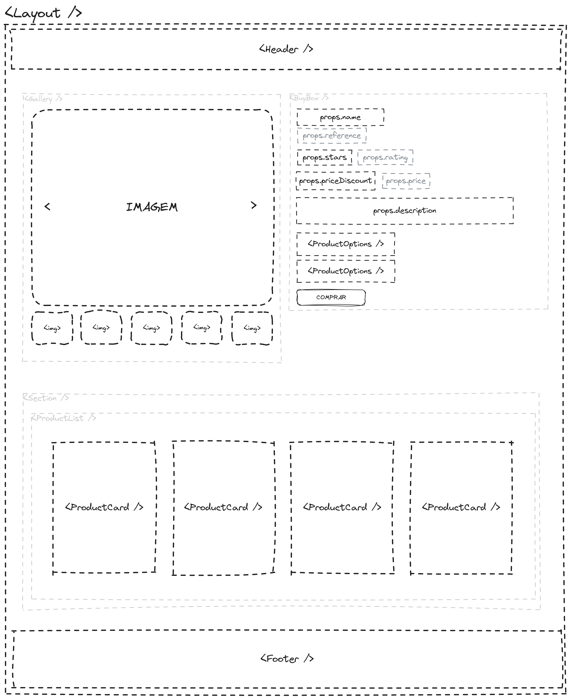
</details>
</details>

